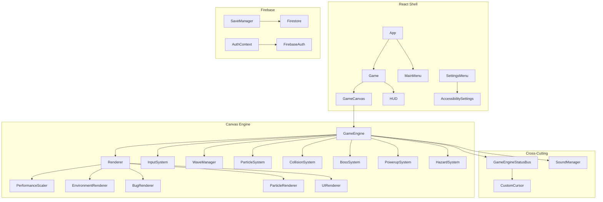

# BUGSMASHER — System Architecture

## High-Level Diagram



## Game Loop

1. `requestAnimationFrame` → `GameEngine.loop(dt)`  
2. `update(dt)` — systems, wave spawn, collisions  
3. `Renderer.draw()` — environment → particles → entities → UI overlays  
4. `GameEngineStatusBus.publish()` — HUD/cursor sync  

**Invariant:** All gameplay timing uses `dt` (seconds). No `setInterval` for game state.

## Module Boundaries

| Module | Responsibility | Must NOT |
|--------|----------------|----------|
| `GameEngine` | Orchestration, session state | Boss AI details, draw code |
| `WaveManager` | Spawn pacing, boss waves | Collision resolution |
| `CollisionSystem` | Hit detection, damage routing | UI, audio |
| `Renderer` | Draw order, camera shake | Game rules |
| `*Renderer.ts` | Primitive drawing | Score/progression |

## Data Flow — Saves

```
GameSaveData → ChecksumSystem.generate() → localStorage + Firestore
```

**Debt:** Checksum verified client-side only. Server validation required for competitive integrity (see ADR-002).

## Key Files

| Path | Purpose |
|------|---------|
| `src/game/GameEngine.ts` | Session orchestrator |
| `src/game/GameTypes.ts` | Entity interfaces |
| `src/game/GameConfig.ts` | Balance constants |
| `src/game/rendering/*` | Canvas draw specialists |
| `src/lib/firebaseService.ts` | Cloud persistence |